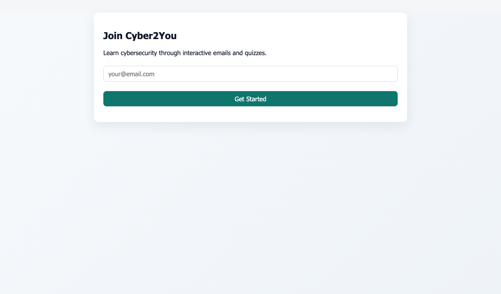
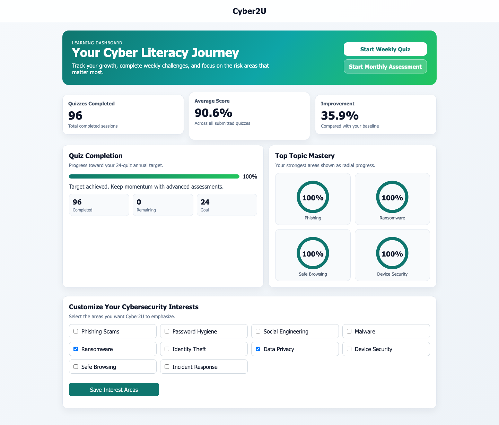
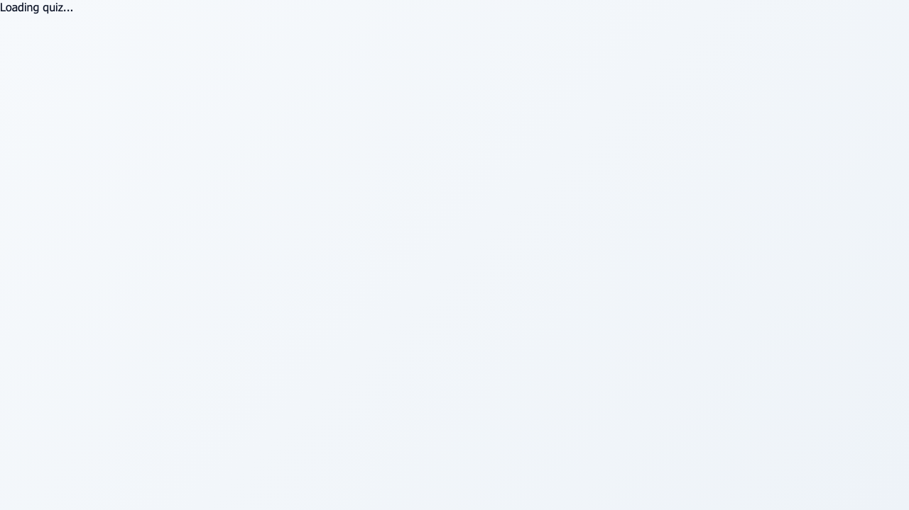
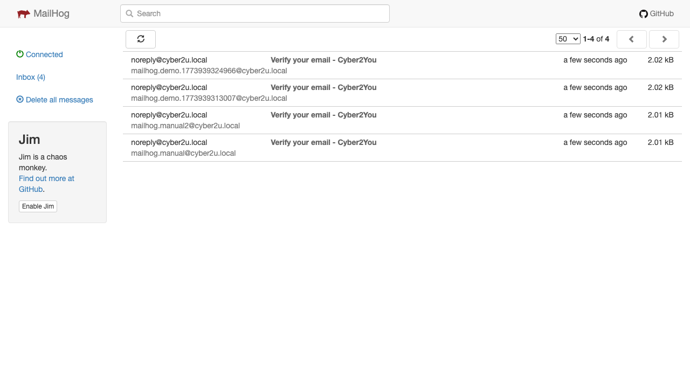
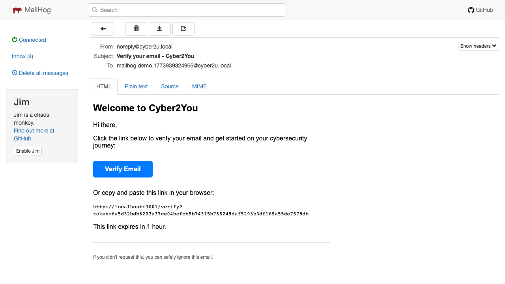

# Cyber2U: Interactive Email-Based Cybersecurity Awareness Platform

## Overview

Cyber2U is an interactive, email-driven platform designed to raise cybersecurity literacy and awareness among students, employees, and the general public. The platform delivers:

- **Weekly cybersecurity emails** with tips, facts, and interactive case studies
- **Monthly assessments** to test knowledge and track progress
- **Learner dashboards** showing progress, topic mastery, and improvement trends
- **Admin content workflow** for creating, reviewing, and scheduling campaigns
- **Analytics reporting** aligned to project objectives

## App Screenshots

These screenshots are generated from a Playwright run and committed to this repository.







Walkthrough video (Playwright-generated):
- [Cyber2U App Walkthrough](docs/videos/cyber2u-walkthrough.webm)

## Features

### Phase 1: Foundation (Current)
- [x] Project scaffolding (backend, frontend, database)
- [x] Database schema and migrations
- [x] Local development environment (docker-compose)
- [x] Authentication middleware

### Phase 2: Authentication (Next)
- [ ] Magic-link email authentication
- [ ] Session management
- [ ] GDPR consent capture

### Phase 3: Formsubmit Integration
- [x] Signup form ingestion (webhook endpoint)
- [x] User deduplication and normalization
- [x] Verification email workflow

### Phase 4-8: Core Features (Planned)
- [ ] Quiz engine and scoring
- [ ] Progress tracking
- [ ] Content operations admin interface
- [ ] Campaign scheduling and delivery
- [x] Analytics and reporting (summary + quarterly endpoints)

## Quick Start

### Prerequisites
- Docker & Docker Compose
- Node.js 18+ (for local development without Docker)
- PostgreSQL 16 (or use docker-compose)

### Development Setup

```bash
# 1. Clone and navigate
cd /Users/nathanbrown-bennett/Haned-Cyber2U

# 2. Copy environment template
cp .env.example .env

# 3. Start services with Docker Compose
docker-compose up -d

# 4. Verify services
curl http://localhost:3000/health  # Backend
curl http://localhost:3001        # Frontend
open http://localhost:8025         # MailHog email UI
```

### Two-Container Simulation Mode

The compose stack now includes:
1. Backend stack: backend + postgres + mailhog + frontend
2. Simulated user container: sim-user (acts like a user signing up and checking received mail)

Run backend stack:

```bash
docker-compose up -d postgres mailhog backend frontend
```

Run simulated user flow:

```bash
docker-compose --profile simulation up --build sim-user
```

The sim-user container will:
1. Submit signup to backend
2. Poll MailHog inbox API
3. Extract magic-link token from received email
4. Verify account and fetch profile

Inspect mailbox manually at: http://localhost:8025

### Demo User Route (Seed Visible Data)

If dashboard/quiz are empty, use this route to create a demo user, complete sample quizzes, and sign in automatically:

`http://localhost:3001/demo-user`

This route calls `POST /api/auth/demo-bootstrap`, seeds sample completed quiz sessions, recalculates progress, stores an auth token in browser storage, and redirects to dashboard.

### Local Development (without Docker)

**Backend:**
```bash
cd backend
npm install
npm run dev
```

**Frontend:**
```bash
cd frontend
npm install
npm run dev
```

**Database:**
Ensure PostgreSQL is running and then run migrations:
```bash
npm run migrate
```

## Architecture

```
┌────────────────────────────────────────────────────────┐
│                  Frontend (React + Vite)                │
│         Signup | Dashboard | Quiz Player | Admin         │
└─────────────────────┬────────────────────────────────────┘
                      │ HTTP/JSON
                      ▼
┌────────────────────────────────────────────────────────┐
│           Backend (Express + TypeScript)                │
│  Auth | Quiz | Progress | Campaigns | Analytics         │
└─────────────────────┬────────────────────────────────────┘
                      │ SQL
                      ▼
┌────────────────────────────────────────────────────────┐
│              PostgreSQL + Migrations                     │
│  Users | Quizzes | Progress | Campaigns | Audit Logs    │
└────────────────────────────────────────────────────────┘
```

## API Endpoints (Planned)

### Authentication
- `POST /api/auth/request-magic-link` — Request email verification
- `POST /api/auth/verify` — Verify magic link and create session
- `GET /api/auth/profile` — Get authenticated user profile

### Formsubmit Webhook
- `POST /api/webhook/formsubmit` — Accepts formsubmit payload, normalizes email, creates verification token, and sends magic-link email

Example HTML form (formsubmit -> Cyber2U webhook):

```html
<form action="https://formsubmit.co/your-formsubmit-id" method="POST">
    <input type="email" name="email" required />
    <input type="hidden" name="source" value="landing-page" />
    <input type="hidden" name="_next" value="http://localhost:3001/thanks" />
    <button type="submit">Join Cyber2U</button>
</form>
```

### Quizzes
- `GET /api/quiz/weekly` — Get weekly mini-quiz
- `GET /api/quiz/monthly` — Get monthly assessment
- `POST /api/quiz/:id/submit` — Submit answers and get score

### Progress
- `GET /api/progress` — Get learner progress summary
- `GET /api/progress/timeline` — Get progress over time
- `GET /api/progress/topics` — Get topic-level mastery

### Campaigns (Admin)
- `GET /api/campaigns` — List campaigns
- `POST /api/campaigns` — Create new campaign
- `PUT /api/campaigns/:id` — Update campaign
- `POST /api/campaigns/:id/approve` — Approve for scheduling

### Analytics (Admin)
- `GET /api/analytics/summary` — KPI summary
- `GET /api/analytics/monthly-report` — Monthly report export

Implemented analytics endpoints:
- `GET /api/analytics/summary`
- `GET /api/analytics/campaigns/:id`
- `POST /api/analytics/campaigns/:id/recalculate`
- `GET /api/analytics/quarterly-report?year=YYYY&quarter=1-4`

## Database Schema

See [docs/DATA_MODEL.md](docs/DATA_MODEL.md) for detailed schema documentation.

Key tables:
- `users` — User accounts
- `email_verifications` — Magic-link tokens
- `campaigns` — Email campaigns and assessments
- `campaign_versions` — Version history with approval workflow
- `quiz_questions` — Quiz questions and options
- `quiz_attempts` — User answers
- `user_progress_snapshots` — Calculated progress trendlines
- `campaign_deliveries` — Email delivery tracking
- `audit_logs` — GDPR audit trail

## Environment Variables

See [.env.example](.env.example) for all configuration options:

| Variable | Default | Description |
|----------|---------|-------------|
| `PORT` | 3000 | Backend server port |
| `NODE_ENV` | development | Environment |
| `DB_HOST` | localhost | PostgreSQL host |
| `DB_PORT` | 5432 | PostgreSQL port |
| `JWT_SECRET` | dev-secret | JWT signing key |
| `EMAIL_HOST` | localhost | SMTP host |
| `EMAIL_PORT` | 1025 | SMTP port (MailHog in dev) |

## Testing

```bash
# Backend unit tests
cd backend
npm test

# Backend tests in watch mode
npm run test:watch

# Frontend tests (placeholder)
cd frontend
npm test

# Playwright smoke and screenshot tests
cd frontend
npm run test:e2e
```

## GDPR & Security

- ✅ Magic-link authentication (no passwords stored)
- ✅ Consent capture and versioning
- ✅ Right-to-erasure support
- ✅ Data retention policies enforced
- ✅ Encrypted session tokens
- ✅ HTTPS-ready configuration
- ✅ Rate limiting and CSRF protection

See [docs/SECURITY_GDPR.md](docs/SECURITY_GDPR.md) for details.

## Deployment

For production deployment, see [docs/DEPLOYMENT.md](docs/DEPLOYMENT.md).

Key steps:
1. Set strong `JWT_SECRET` and `DB_PASSWORD`
2. Use production email service (SendGrid, Mailgun, AWS SES)
3. Enable HTTPS
4. Run migrations on production database
5. Use managed PostgreSQL (RDS, Neon, etc.)

## Contributing

1. Create a feature branch: `git checkout -b feature/your-feature`
2. Commit changes: `git commit -am 'Add feature'`
3. Push: `git push origin feature/your-feature`
4. Open a pull request

## Project Objectives

From the dissertation proposal:

**Objective 1:** Improve cybersecurity awareness and engagement
- Target: Increase email open rate by 15%, CTR by 10%, list growth by 20%

**Objective 2:** Assess and improve user cybersecurity knowledge
- Target: Increase average quiz score by 20%, achieve 75% participation, reduce wrong answers by 30%

**Objective 3:** Evaluate campaign impact for scalability
- Target: 85% satisfaction rating, quarterly reporting, scalability assessment

## Support

For issues or questions:
1. Check existing documentation in `docs/`
2. Review [RUNBOOK.md](docs/RUNBOOK.md) for common operations
3. Check backend/frontend logs via docker-compose: `docker-compose logs -f {service}`
4. MailHog UI at http://localhost:8025 for email debugging

## License

[Specify your license here]

## Timeline

- **Phase 1:** Bootstrap (Current)
- **Phase 2-3:** Authentication & Signup (Weeks 1-2)
- **Phase 4-6:** Quiz Engine & Progress (Weeks 3-5)
- **Phase 7-8:** Campaigns & Analytics (Weeks 6-8)
- **Phase 9:** GDPR & Security (Weeks 8-9)
- **Phase 10:** Pilot & QA (Weeks 9-10)
